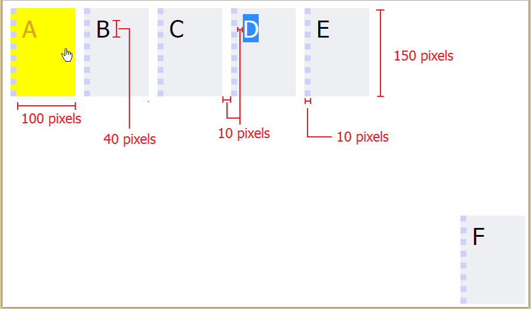

# Tugas Praktikum 1

#### Tujuan Pembuatan Tugas

Diharapkan dengan tugas ini anda dapat mengerti HTML & CSS

#### Soal 1 (20 Poin)

Buatlah suatu file HTML yang memiliki dua tampilan / antar muka yang bebeda. Antarmuka tersebut didasarkan pada suatu dokumen CSS. File HTML tersebut diberi nama index.html dengan judul Tugas Praktikum IF-3121. Kedua dokumen CSS tersebut bernama styleA.css dan styleB.css

Jika file HTML tersebut menggunakan styleA.css maka akan tempil seperti gambar berikut:

Spesifikasi Tampilan A
1. Harus ada enam elemen kotak, berbaris vertikal.
2. Semua kotak terpusat secara horizontal dan sama-sama berjarak vertikal, termasuk pada saat jendela diubah ukurannya. Dengan kata lain, jarak vertikal antar kotak tetap dan tidak harus diperbaiki.
3. Setiap kotak berukuran 100x100 piksel, dengan garis 1px (warna: #687291) di atas. Teks dipusatkan secara horizontal.
4. Kotak warna alternatif (warna: #dfe1e7, #eeeff2).
5. Elemen terakhir (warna: #687291) memiliki batas hitam 4px dan teks dipusatkan secara vertikal.
6. Menggunakan huruf Tahoma, 40 piksel.

Jika file HTML tersebut menggunakan styleB.css maka akan tempil seperti gambar berikut:

	

Spesifikasi Tampilan B
1. Lima elemen kotak, berbaris horizontal di pojok kiri atas.
2. Tepi Kotak tidak ditebalkan.
3. Kotak terakhir diposisikan di sudut kanan bawah halaman browser dan tetap diposisi tersebut saat jendela diubah ukurannya.
4. Setiap kotak adalah 100x150 piksel (warna: #eeeff2), dengan garis putus-putus 10px (warna: #D0D0FF) di sebelah kiri. Kotak dipisahkan oleh 10 piksel ruang.
5. Saat berada di atas sebuah kotak, kursor berubah menjadi icon tangan serta kotak dan warna font berubah (warna: kuning, goldenrod, masing-masing).
6. Menggunakan Font Tahoma, 40 piksel.
7. Jarak / Ruaang antara huruf dan tepi kotak adalah 10 piksel.

#### Soal 2 (50 Poin)
Lakukan validasi HTML untuk mendapatkan stuktur HTML dan CSS yang sesuai dengan standar W3C, dengan menggunakan HTML validator di web <a href="http://validator.w3.org">http://validator.w3.org</a>

#### Petunjuk Pengumpulan

1. Buatlah akun pribadi anda di github.
3. Fork pada repository ini dengan akun yang telah anda dibuat.
4. Silakan commit pada repository anda (hasil fork). Lakukan berberapa commit dengan pesan yang bermakna, contoh: `fix css`, `create post done`, jangan seperti `final`, `benerin dikit`. Disarankan untuk tidak melakukan commit dengan perubahan yang besar karena akan mempengaruhi penilaian (contoh: hanya melakukan satu commit kemudian dikumpulkan).
6. Pull request dari repository anda ke repository ini dengan format (hilangkan tanda bintang) **Nama Lengkap dengan NIM** sebelum **Rabu, 12 September 2017 Pukul 23.59 WIB**.

#### Dosen
- Ahmad Luky Ramdani S.Kom., M.Kom. Email: ahmadluky@if.itera.ac.id
- Hafiz Budi Firmansyah, S.Kom., M.Sc. Email: hafiz.budi@itera.ac.id 

#### Referensi
Link : <a href="http://web.stanford.edu/class/cs142/index.html">http://web.stanford.edu/class/cs142/index.html</a>.
